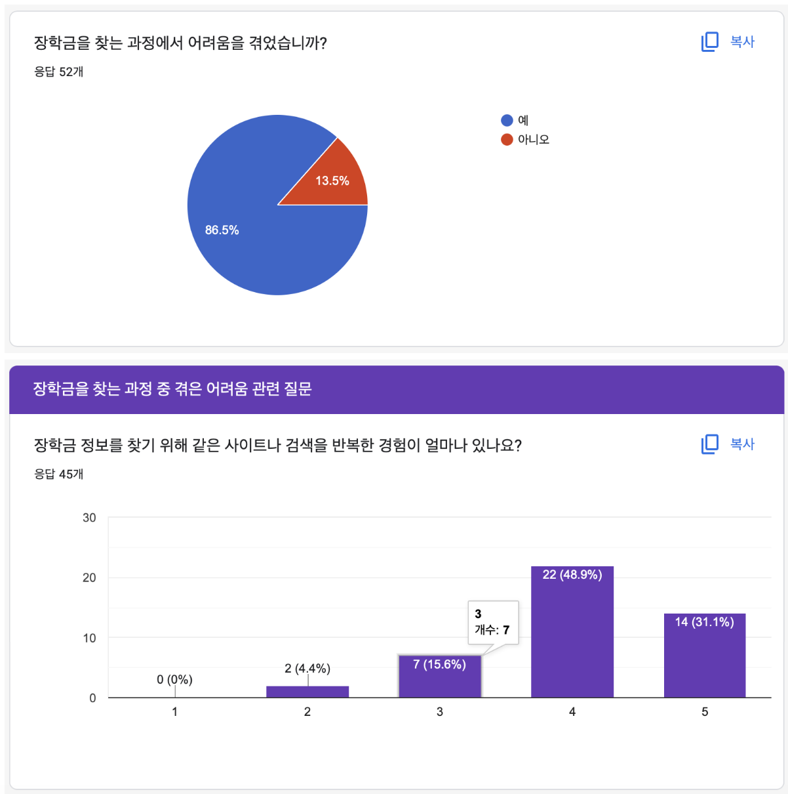
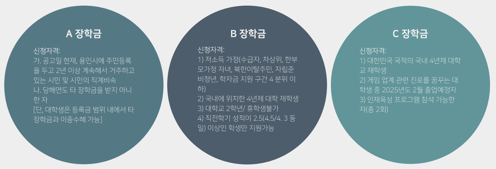
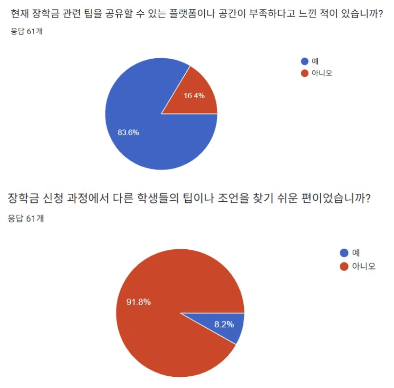
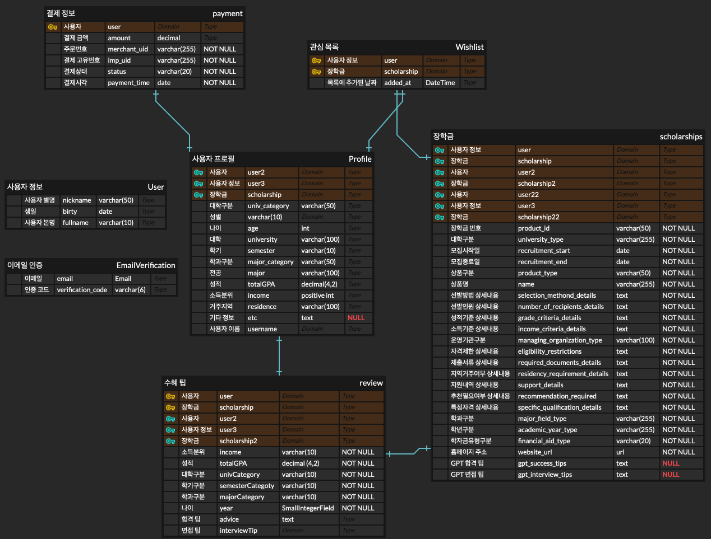

<!-- Template for PROJECT REPORT of CapstoneDesign 2024-2H, initially written by khyoo -->
<!-- 본 파일은 2024년도 컴공 졸업프로젝트의 <1차보고서> 작성을 위한 기본 양식입니다. -->
<!-- 아래에 "*"..."*" 표시는 italic체로 출력하기 위해서 사용한 것입니다. -->
<!-- "내용"에 해당하는 부분을 지우고, 여러분 과제의 내용을 작성해 주세요. -->

# Team-Info
| (1) 과제명 | *SCHOLLI : 자신에게 적합한 장학금을 찾는 대학생을 위해 생성형 AI를 이용하여 각 사용자에게 맞는 장학금을 추천하고 이전 수혜자들의 조언을 바탕으로 장학금 수혜 팁을 제공해주는 서비스*
|:---  |---  |
| (2) 팀 번호 / 팀 이름 | *06-머스캣* |
| (3) 팀 구성원 | 채민주 (2076405): 리더, React 프론트엔드 개발, 프로토타입 제작, 프론트엔드 배포환경 세팅   이서연 (2176255): 팀원, 추천 알고리즘 개발, 수혜팁 추출 기능 개발, Django API 개발  변하영 (2173039) : 팀원, Django API 개발, 프로토타입 제작, 백엔드 배포환경 세팅			 |
| (4) 팀 지도교수 | 심재형 교수님 |
| (5) 팀 멘토 | 이수현 / 개발자 / 네이버 |
| (6) 과제 분류 | 산학과제  |
| (6) 과제 키워드 | 생성형 AI, 프롬프트 엔지니어링, 추천시스템  |
| (7) 과제 내용 요약 | SCHOLLI는 대학생들이 방대한 장학금 정보 속에서 자신에게 적합한 장학금을 쉽고 빠르게 찾을 수 있도록 돕는 AI 기반 장학금 추천 서비스입니다. 통합된 장학금 정보를 제공해 탐색 시간을 줄이고 AI 기술을 활용해 성적, 경제적 상황, 전공뿐만 아니라 진로 계획, 수상 경력 및 언어 능력과 같은 특기자 정보 등 세부 정보를 분석하여 개인 맞춤형 장학금을 추천합니다. 또한, 이전 장학금 수혜자들이 합격팁과 면접팁을 공유하고 이를 추출해 수혜팁을 제공합니다. 이를 바탕으로 사용자는 보다 전략적으로 장학금을 지원할 수 있습니다. SCHOLLI는 장학금 지원 기회를 놓치는 문제를 해결하고, 더 많은 학생들에게 교육의 평등성을 제공하는 것을 목표로 합니다. |

 

# Project-Summary
| 항목            | 내용                                                                                                                                                                                                                                                                                                                                                                                                                                                                                                                                                                                                                                                                                                                                                                                                                                                                                                                                                                          |
| :------------ | --------------------------------------------------------------------------------------------------------------------------------------------------------------------------------------------------------------------------------------------------------------------------------------------------------------------------------------------------------------------------------------------------------------------------------------------------------------------------------------------------------------------------------------------------------------------------------------------------------------------------------------------------------------------------------------------------------------------------------------------------------------------------------------------------------------------------------------------------------------------------------------------------------------------------------------------------------------------------- |
| (1) 문제 정의     | **1. 방대한 장학 정보로 인한 탐색의 어려움** 한국장학협회에 따르면 2020년 기준 1182건의 장학금이 존재하고 서울특별시교육청 자료에 따르면 1814건의 장학재단이 존재합니다. 이로 인해 많은 대학생들이 적합한 장학금을 찾는 데 큰 어려움을 겪고 있습니다. 장학금을 지원해본 경험이 있는 사람들을 대상으로 진행한 설문조사에 따르면 80% 이상의 학생들이 장학금 탐색 과정에서 어려움을 경험한 적이 있다고 답했습니다.    **2. 상이한 신청 자격으로 인한 혼란** 장학금마다 요구하는 자격 요건이 상이하여 학생들이 자신에게 맞는 장학금을 찾기 어렵습니다. 이로 인해 자신에게 적합한 장학금을 찾지 못하거나 자격을 갖추고 있음에도 불구하고 지원 기회를 놓치는 경우가 빈번합니다.   **3. 장학금 수혜 팁 공유 공간 부족** 진행한 설문조사에 따르면 학생들 61명 중 약 92%가 장학금 신청 과정에서 다른 학생들의 조언을 찾기 어렵다고 답하였고, 약 84%의 학생들이 장학금 관련 팁을 공유할 수 있는 공간이 부족하다고 느꼈다고 답하였습니다. 이는 많은 학생들이 장학금 신청 과정에서 정보 공유의 필요성을 느끼지만, 이를 효과적으로 제공해 줄 수 있는 공간이 부족하다는 점을 보여줍니다.                                                                                                                                                                                                                                              |
| (2) 기존연구와의 비교 | **1. 드림스폰** - 기술적 특징: 드림스폰은 여러 장학금 정보를 모아 통합적으로 제공하는 시스템입니다. 학생들은 여러 곳에 흩어져 있는 장학금 정보를 한 곳에서 확인할 수 있어 시간 절약이 가능합니다. - 장점: 방대한 장학 정보를 쉽게 접근할 수 있으며, 다양한 장학 정보를 통합적으로 제공하므로 학생들이 일일이 장학금을 검색할 필요가 없습니다. - 단점: 학생 개개인의 특성이나 요구 사항을 충분히 반영하지 않고, 단순히 나열된 정보를 제공하는 데 그치기 때문에 개인 맞춤형 서비스의 한계가 있습니다.  **2. 한국장학재단** - 기술적 특징: 한국장학재단의 스마트학자금 맞춤설계는 학생이 입력한 전공, 성적, 경제적 상황을 기준으로 맞춤형 장학금 추천을 제공합니다. - 장점: 장학금 신청 시 학생의 상황에 맞는 설계를 제공해, 불필요한 정보 탐색 시간을 줄일 수 있습니다. - 단점: 전공, 성적, 경제적 상황에 집중되어 있어 다른 중요한 요소(예: 진로 계획, 대외활동, 언어 능력 등)를 충분히 고려하지 않기 때문에 추천의 정확도가 떨어질 수 있습니다.  **3. SCHOLLI의 차별성** - 기술적 특징: SCHOLLI는 AI를 기반으로 전공, 학생의 성적, 경제적 상황뿐만 아니라 진로 계획, 대외활동, 수상 경력, 언어 능력 등 다양한 개인 정보를 반영하여 더욱 세밀하게 맞춤형 장학금을 추천합니다. - 장점: 드림스폰과 한국 장학재단과 달리, SCHOLLI는 학생 개개인의 다양한 특성과 진로 목표를 반영해 개인 맞춤형 추천을 제공합니다. 또한, 수집한 이전 장학금 수혜자들의 합격팁과 면접팁을 바탕으로 수혜팁을 추출해 각 장학금마다 제공함으로써, 사용자들이 장학금 지원 시 실질적인 도움을 받을 수 있고 이를 통해 학생들은 보다 전략적이고 효과적으로 장학금 지원을 준비할 수 있습니다. |
| (3) 제안 내용     | **1. 통합된 장학 정보를 제공하여 탐색 시간 절감** 장학금 정보를 통합하여 제공함으로써 방대한 장학 정보로 인한 탐색의 어려움을 해소하고 장학금 탐색에 소요되는 시간을 대폭 절감하고자 합니다.  **2. AI를 통한 개인별 맞춤 추천 장학금 제공** AI 기술을 활용해 차별화된 개인 맞춤형 장학금 추천 서비스를 제공합니다. 학생의 성적, 경제적 상황, 전공뿐만 아니라 진로 계획, 수상 경력 및 언어 능력과 같은 특기자 정보 등 세부적인 정보를 분석해 더욱 정교하고 개인화된 장학금을 추천합니다. 이를 통해 상이한 신청 자격으로 인한 혼란을 최소화하고자 합니다.  **3. 장학금 수혜 팁 공유 공간 구축** 이전 수혜자들이 합격팁과 면접팁을 공유하도록 유도하고 중요한 내용을 추출하여 사용자들에게 제공함으로써 장학금 수혜팁을 공유할 수 있는 공간의 부족 문제를 해결하고자 합니다. 이를 통해 사용자가 효율적으로 정보를 얻고 장학금 신청에 도움이 되는 실질적인 조언을 받을 수 있도록 합니다.                                                                                                                                                                                                                                                                                                                                                                                                                                |
| (4) 기대효과 및 의의 | **1. 경제적 여건으로 인한 교육 기회 불균형 해소** 통계청의 조사에 따르면, 13세 이상 인구 중 40%가 교육 기회 불충분을 경험했으며, 그 중 54.6%가 경제적 이유를 들었습니다. 이는 많은 학생들이 경제적 이유로 원하는 교육을 받지 못하고 있음을 보여줍니다. SCHOLLI는 경제적 장벽을 해소하고 교육 기회를 확대함으로써 교육의 평등성을 강화하고자 합니다.  **2. 사용자 편의성 향상 및 장학금 신청 기회 확대** 장학금 정보를 한 플랫폼에서 제공함으로써, 방대한 장학 정보로 인한 탐색의 어려움을 해소하여 보다 효율적으로 장학금을 신청할 수 있도록 돕습니다. 또한, 개인 맞춤형 장학금 추천을 통해 다양한 신청 자격을 가진 장학금 중에서 개인에게 적합한 장학금을 찾아주며, 이는 신청 과정에서의 혼란을 최소화하고 신청 기회를 확대합니다.                                                                                                                                                                                                                                                                                                                                                                                                                                                                                                                         |
| (5) 주요 기능 리스트 | **주요 기능1: 통합된 데이터** 다양한 기관과 단체에서 제공하는 장학금 정보를 하나의 데이터베이스로 통합하여, 사용자가 한 곳에서 손쉽게 장학금 정보를 검색하고 관리할 수 있도록 합니다. 이를 통해 복잡한 정보 탐색 과정을 간소화하고 사용자에게 필요한 장학금 정보를 보다 신속하고 효율적으로 제공할 수 있습니다.  **주요 기능2: AI 맞춤형 장학금 추천** AI를 활용하여 사용자의 학업 성적, 경제 상황, 관심 분야 등 학생 개개인의 세부 사항을 분석하고 이에 맞춰 개인에게 가장 적합한 장학금을 추천합니다. 이를 통해 상이한 자격 요건으로 인한 혼란을 최소화하고 사용자가 놓칠 수 있는 장학금 신청 기회를 확대합니다.  **주요 기능3: 수혜 팁 제공** 이전 장학금 수혜자들의 합격팁과 면접팁을 포인트 제공 방식으로 수집하고 분석하여, 각 장학금 별로 수혜팁을 제공합니다. 이는 신청자가 보다 효과적으로 장학금을 신청할 수 있도록 돕습니다.  **부가 기능1: 캘린더 기능** 사용자가 찜한 장학금의 신청 마감일, 필요한 제출 서류 등을 한 번에 확인할 수 있으며, 마감일이 다가올 때 알림을 통해 중요한 일정을 놓치지 않도록 도와줍니다.  **부가 기능2: 장학금 등록 기능** 각 장학 재단이 개별 사이트를 이용할 필요 없이, SCHOLLI를 통해 직접 장학 공고를 게시할 수 있도록 지원합니다. 재단이나 단체뿐만 아니라 개인도 소액의 장학금이나 물품을 등록할 수 있으며, 이를 통해 더 다양한 장학 기회가 제공됩니다.                                                                                                                                                          |

 
 
# Project-Design
| 항목             | 내용                                                                                                                                                                                                                                                                                                                                                                                                                                                                                                                                                                                                                                                                                                                                                                                                                                                                                                                                                                                                                                                                                                                                                                                                                                                                                                                                                                                                                                                                                                                                                                                                                                                                                                                                                                                                                                                                                                                                                          |
| :------------- | ----------------------------------------------------------------------------------------------------------------------------------------------------------------------------------------------------------------------------------------------------------------------------------------------------------------------------------------------------------------------------------------------------------------------------------------------------------------------------------------------------------------------------------------------------------------------------------------------------------------------------------------------------------------------------------------------------------------------------------------------------------------------------------------------------------------------------------------------------------------------------------------------------------------------------------------------------------------------------------------------------------------------------------------------------------------------------------------------------------------------------------------------------------------------------------------------------------------------------------------------------------------------------------------------------------------------------------------------------------------------------------------------------------------------------------------------------------------------------------------------------------------------------------------------------------------------------------------------------------------------------------------------------------------------------------------------------------------------------------------------------------------------------------------------------------------------------------------------------------------------------------------------------------------------------------------------------------- |
| (1) 요구사항 정의    | **유저플로우**  1. 메인페이지로 들어가면 전체 장학금, 추천 장학금, 마이페이지, 장학금 등록 버튼이 있습니다. 2. 전체 장학금 버튼 누를 경우 전체 장학금의 목록들을 볼 수 있습니다.     - 목록에 있는 장학금 중 본인이 관심있는 장학금을 관심 목록에 추가할 수 있습니다.     - 목록에서 이전 수혜자 정보 보기를 선택하여 장학금별로 이전 수혜자들의 조언을 볼 수 있습니다.     - 목록에서 특정 장학금을 선택하면 장학금 상세 페이지로 이동하며, 장학금별로 상세 정보와 해당 장학금의 이전 수혜자들의 조언을 추출한 팁을 조회할 수 있습니다. 3. 추천 장학금 버튼을 누를 경우 개인 정보를 입력했는지 안했는지 확인합니다.     - 사용자가 개인정보를 입력하지 않았다면 마이페이지의 개인정보 입력하는 페이지로 이동하여 정보를 입력받습니다.     - 이미 개인 정보가 입력되어 있다면 추천 받기 버튼을 누르면 포인트가 차감되며 사용자에게 적합한 장학금이 추천되어 목록으로 제공됩니다. 4. 마이페이지 버튼을 누를 경우 마이페이지로 이동합니다.     - 개인정보를 입력하거나 입력했던 개인 정보를 조회 및 수정할 수 있습니다. 5. 장학금 등록 버튼을 누를 경우 장학금을 등록할 수 있는 페이지로 이동합니다.     - 장학금을 등록하기 위해 필요한 정보를 입력하고 등록 버튼을 누르면 장학금이 등록됩니다.   **ER다이어그램**  사용자 정보, 이메일 인증, 결제 정보, 관심 목록, 사용자 프로필, 수혜 팁, 장학금의 정보를 저장하는 총 7개의 테이블이 있습니다.  1. 사용자 정보 (User) 테이블     - 수혜 팁 작성 후 공개 시, 개인 정보 보호를 위해 최소한의 정보를 입력받는 테이블로 사용자 별명, 생일, 사용자 본명을 입력받습니다. 2. 이메일 인증 (EmailVerification) 테이블     - 회원가입시 이메일 인증을 하기 위한 테이블로 이메일과 받은 인증 코드를 저장합니다. 3. 결제 정보 (Payment) 테이블     - 포인트 충전시 결제할 때 사용되는 테이블로 결제 금액, 주문 번호, 결제 고유번호와 결제 상태, 결제 시각이 저장됩니다.     - 각 사용자마다 결제 정보를 저장해야 하므로 사용자 프로필 테이블과 1:1로 매핑됩니다. 4. 관심 목록 (Wishlist) 테이블     - 사용자가 관심있는 장학금을 저장하는 테이블로 사용자의 정보와 장학금 정보 및 목록에 추가된 날짜가 저장됩니다.     - 각 사용자별로 장학금의 정보를 저장해야 하므로 사용자 프로필 테이블과 장학금 테이블이 각각 1:1 매핑됩니다. 5. 사용자 프로필 (Profile) 테이블     - 사용자에게 장학금을 추천해주기 위해 대학구분, 성별, 전공, 성적 등 사용자의 정보를 입력받아 저장하는 테이블입니다. 6. 수혜 팁 (Review) 테이블     - 장학금별로 사용자가 작성한 합격 팁, 면접 팁이 저장되는 테이블로 해당 사용자의 정보 중 일부만 팁과 함께 저장합니다.     - 각 사용자별로 특정 장학금에 수혜 팁을 작성하므로 사용자 프로필 테이블과 장학금 테이블과 각각 1:1로 매핑됩니다. 7. 장학금 (Scholarships) 테이블     - 공공API에서 얻은 장학금 정보를 저장하는 테이블로 성적기준, 소득기준 등 장학금 공고에서 필요한 정보를 저장합니다.     - 각 장학금마다 고유의 product_id로 구분되며, 수혜자들이 입력한 조언들을 바탕으로 추출된 GPT 합격팁과 면접팁도 같이 저장됩니다.  |
| (2) 전체 시스템 구성  |  SCHOLLI의 전체 SW 시스템 구조의 동작 원리는 다음과 같습니다.  1. 사용자는 Vercel에 배포된 React 기반의 프론트엔드를 통해 Axios로 백엔드에 요청을 보냅니다.  2. Nginx 서버는 클라이언트의 요청을 Gunicorn을 거쳐 Django로 전달합니다.  3. Django는 데이터베이스와 상호작용하여 데이터를 관리합니다.  4. 기능 구현에 Redis, Celery, PortOne, OpenAI 모듈들이 활용됩니다.  5. Docker로 컨테이너화된 애플리케이션은 EC2에서 실행되며 깃허브 액션으로 자동 배포됩니다.  다음은 SW구조도에서의 흐름에 대해 설명하겠습니다. 여기서의 화살표는 각 구성 요소 간의 데이터 흐름과 통신을 나타냅니다. 아래는 각 화살표의 의미입니다. 1.사용자 ↔ vercel (React) : 사용자는 브라우저에서 Vercel에 배포된 리액트 애플리케이션에 접근합니다. 이 화살표는 사용자가 프론트엔드와 상호작용하는 과정을 나타냅니다.  2. Vercel ↔ Axios ↔ Nginx : 프론트엔드는 Axios를 통해 Nginx 웹 서버로 요청을 보냅니다.  3.Nginx ↔ Gunicorn : Nginx 웹 서버는 들어오는 요청을 Gunicorn으로 전달합니다. 4. Gunicorn ↔ Django : Gunicorn은 Django 애플리케이션 서버에 요청을 전달합니다.  5. Django ↔ MySQL : Django 애플래케이션은 필요한 경우 Amazon RDS에 저장된 MySQL 데이터베이스와 통신하여 데이터를 조회하거나 저장합니다.  6. Django ↔ Redis : Django 애플리케이션은 Redis와 상호작용하여 Celery 작업 큐를 관리합니다.  7. Django ↔ Celery : Django는 Celery를 통해 비동기 작업을 실행합니다.   8. Github ↔ Github Actions ↔ Amazon EC2 : Github에 저장된 코드가 Github Actions를 통해 CI/CD 파이프라인으로 구성하고 자동으로 Amazon EC2에 배포됩니다.   9. Django ↔ OpenAI/PortOne : Django는 OpenAI와 통신하여 AI 기반 추천 시스템과 수혜 팁 추출 기능을 제공합니다. 또한, PortOne과 통신하여 결제 관련 서비스를 처리합니다. 

|
| (3) 주요엔진 및 기능 설계 | 다음은 SCHOLLI의 주요 기능 구현을 위한 모듈의 설계 내용입니다.    1. 장학금 목록 조회 이 모듈은 장학금 목록을 조회할 수 있는 모듈로, 장학금을 검색, 정렬, 필터링하여 보여주는 기능을 포함합니다. 해당 모듈은 Django의 ListAPIView를 사용하여 구현되었습니다. 장학금 목록을 보여주기 위해서는 장학금 정보를 먼저 저장해야하는데, SCHOLLI는 다음과 같이 장학금 정보를 저장합니다.  다양한 장학금 정보를 저장하기 위해 여러 필드를 포함한 Scholarship 모델을 작성하였습니다. 이 모델이 포함하는 필드는 다음과 같습니다.  1. university_type : 장학금이 어떤 유형의 대학을 대상으로 하는 지 저장하는 필드입니다.   2. recruitment_start 및 recruitment_end : 장학금 모집 시작일과 종료일을 저장하는 필드입니다.   3. product_id : 장학금의 고유 번호를 저장하는 필드입니다.   4. product_type 및 name : 장학금의 구분과 이름을 저장하는 필드입니다.   5. selection_method_details :  선발 기준 및 절차에 대한 상세한 내용을 저장하는 필드입니다.   6. number_of_recipients_details : 선발 인원에 대한 상세한 내용을 저장하는 필드입니다.   7. grade_criteria_details 및 income_criteria_details : 성적 기준과 소득 기준에 대한 상세한 내용을 저장하는 필드입니다.   8. managing_organization_type 및 foundation_name : 장학금을 운영하는 기관의 구분과 기관 이름을 저장하는 필드입니다.   9. eligibility_restrictions : 자격 제한 요소에 대한 정보를 저장하는 필드입니다.   10. required_documents_details : 장학금 신청에 필요한 제출 서류의 상세 내용을 저장하는 필드입니다.   11.  residency_requirement_details : 특정 지역 거주 조건과 관련된 상세 내용을 저장하는 필드입니다.   12. support_details : 장학금 지원금액을 저장하는 필드입니다.   13. recommendation_required : 추천서 필요 여부를 저장하는 필드입니다.   14. specific_qualification_details : 특정 자격 조건에 대한 상세 내용을 저장하는 필드입니다.   15. major_field_type 및 academic_year_type : 장학금이 특정 학과나 학년에 한정되는 경우 학과 구분과 학년 구분을 저장하는 필드입니다.   이렇게 다양한 장학금의 상세 정보를 저장함으로써, 장학금 목록을 찾는 사용자들이 좀 더 빠르고 쉽게 찾을 수 있도록 하였습니다. 
 |

| (4) 주요 기능의 구현 | **스타트 단계에서 검증한 내용** 1. 맞춤형 추천 시스템 기술 검증 - 사용자의 프로필(전공, 성적, 경제적 상황, 관심 분야, 대외활동 내역 등)과 관련된 장학금을 추천하는 시스템의 기술 검증을 진행하였습니다.  - 여러 방법을 시도한 결과, GPT 4o-mini를 활용하여 지역 조건을 먼저 선별한 후 다른 조건들을 필터링하는 방법이 가장 성능이 우수하여 해당 방법을 최종 선택하였습니다.  2. 수혜 팁 추출 기술 검증 - 수집한 이전 수혜자들의 합격팁과 면접팁을 바탕으로 중요한 내용을 추출하여 수혜팁을 제공하는 기능의 기술검증을 진행하였습니다.  - 임의로 입력한 수혜자들의 합격팁과 면접팁을 바탕으로 중요한 내용을 추출하여 정리할 수 있도록 GPT 프롬프트를 작성하였습니다.   **현재 진척도 및 근거 내용** 1. 프론트엔드 - UI/UX 디자인을 바탕으로 개발 진행 중 (현재 약 70% 완료) - 백엔드와 연동 작업 진행 중 (현재 약 50% 완료) - 프론트엔드 서버 배포환경 세팅 완료 (100% 완료) 2. 백엔드 - API 명세서와 ER다이어그램을 바탕으로 API 개발 진행 중 (현재 약 70% 완료) - 백엔드 서버 배포환경 세팅 진행 중 (현재 약 70% 완료) 3. AI - 스타트 단계에서 진행했던 기술 검증을 바탕으로 맞춤형 추천 시스템과 수혜 팁 추출 기능 구축 완료 (100% 완료) - 백엔드와의 연동 작업 진행 중(현재 약 60% 완료)    

 |
| (5) 진척도 및 검증내역 | **스타트 단계에서 검증한 내용** 1. 맞춤형 추천 시스템 기술 검증 - 사용자의 프로필(전공, 성적, 경제적 상황, 관심 분야, 대외활동 내역 등)과 관련된 장학금을 추천하는 시스템의 기술 검증을 진행하였습니다.  - 여러 방법을 시도한 결과, GPT 4o-mini를 활용하여 지역 조건을 먼저 선별한 후 다른 조건들을 필터링하는 방법이 가장 성능이 우수하여 해당 방법을 최종 선택하였습니다.  2. 수혜 팁 추출 기술 검증 - 수집한 이전 수혜자들의 합격팁과 면접팁을 바탕으로 중요한 내용을 추출하여 수혜팁을 제공하는 기능의 기술검증을 진행하였습니다.  - 임의로 입력한 수혜자들의 합격팁과 면접팁을 바탕으로 중요한 내용을 추출하여 정리할 수 있도록 GPT 프롬프트를 작성하였습니다.   **현재 진척도 및 근거 내용** 1. 프론트엔드 - UI/UX 디자인을 바탕으로 개발 진행 중 (현재 약 70% 완료) - 백엔드와 연동 작업 진행 중 (현재 약 50% 완료) - 프론트엔드 서버 배포환경 세팅 완료 (100% 완료) 2. 백엔드 - API 명세서와 ER다이어그램을 바탕으로 API 개발 진행 중 (현재 약 70% 완료) - 백엔드 서버 배포환경 세팅 진행 중 (현재 약 70% 완료) 3. AI - 스타트 단계에서 진행했던 기술 검증을 바탕으로 맞춤형 추천 시스템과 수혜 팁 추출 기능 구축 완료 (100% 완료) - 백엔드와의 연동 작업 진행 중(현재 약 60% 완료)  |                                                                                                                                                                                                                                                                                                                                                                                                                                                                                                                                                                                                                                                                                                                                                                                                                                                                                                                                                                                                                                                                                                                                                      |
| (6) 기타         | **사용자 인터페이스 디자인** https://www.youtube.com/watch?v=7xQanzjT65Y                                                                                                                                                                                                                                                                                                                                                                                                                                                                                                                                                                                                                                                                                                                                                                                                                                                                                                                                                                                                                                                                                                                                                                                                                                                                                                                                                                                                                                                                                                                                                                                                                                                                                                                                                                                                                                                                                            |

 
