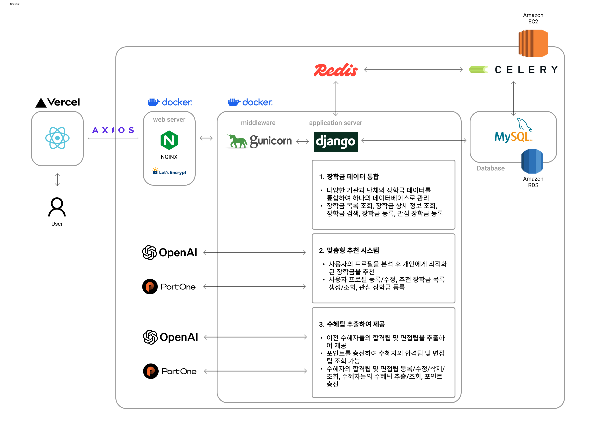

<!-- Template for PROJECT REPORT of CapstoneDesign 2024-2H, initially written by khyoo -->
<!-- 본 파일은 2024년도 컴공 졸업프로젝트의 <1차보고서> 작성을 위한 기본 양식입니다. -->
<!-- 아래에 "*"..."*" 표시는 italic체로 출력하기 위해서 사용한 것입니다. -->
<!-- "내용"에 해당하는 부분을 지우고, 여러분 과제의 내용을 작성해 주세요. -->

# Team-Info
| (1) 과제명 | *SCHOLLI : 자신에게 적합한 장학금을 찾는 대학생을 위해 생성형 AI를 이용하여 각 사용자에게 맞는 장학금을 추천하고 이전 수혜자들의 조언을 바탕으로 장학금 수혜 팁을 제공해주는 서비스*
|:---  |---  |
| (2) 팀 번호 / 팀 이름 | *06-머스캣* |
| (3) 팀 구성원 | 채민주 (2076405): 리더, React 프론트엔드 개발, 프로토타입 제작, 프론트엔드 배포환경 세팅   이서연 (2176255): 팀원, 추천 알고리즘 개발, 수혜팁 추출 기능 개발, Django API 개발  변하영 (2173039) : 팀원, Django API 개발, 프로토타입 제작, 백엔드 배포환경 세팅			 |
| (4) 팀 지도교수 | 심재형 교수님 |
| (5) 팀 멘토 | 이수현 / 개발자 / 네이버 |
| (6) 과제 분류 | 산학과제  |
| (6) 과제 키워드 | 생성형 AI, 프롬프트 엔지니어링, 추천시스템  |
| (7) 과제 내용 요약 | SCHOLLI는 대학생들이 방대한 장학금 정보 속에서 자신에게 적합한 장학금을 쉽고 빠르게 찾을 수 있도록 돕는 AI 기반 장학금 추천 서비스입니다. 통합된 장학금 정보를 제공해 탐색 시간을 줄이고 AI 기술을 활용해 성적, 경제적 상황, 전공뿐만 아니라 진로 계획, 수상 경력 및 언어 능력과 같은 특기자 정보 등 세부 정보를 분석하여 개인 맞춤형 장학금을 추천합니다. 또한, 이전 장학금 수혜자들이 조언을 공유하고 이를 추출해 수혜 팁을 제공합니다. 이를 바탕으로 사용자는 보다 전략적으로 장학금을 지원할 수 있습니다. SCHOLLI는 장학금 지원 기회를 놓치는 문제를 해결하고, 더 많은 학생들에게 교육의 평등성을 제공하는 것을 목표로 합니다. |

 

# Project-Summary
| 항목            | 내용                                                                                                                                                                                                                                                                                                                                                                                                                                                                                                                                                                                                                                                                                                                                                                                                                                                                                                                                                                          |
| :------------ | --------------------------------------------------------------------------------------------------------------------------------------------------------------------------------------------------------------------------------------------------------------------------------------------------------------------------------------------------------------------------------------------------------------------------------------------------------------------------------------------------------------------------------------------------------------------------------------------------------------------------------------------------------------------------------------------------------------------------------------------------------------------------------------------------------------------------------------------------------------------------------------------------------------------------------------------------------------------------- |
| (1) 문제 정의     | **1. 방대한 장학 정보로 인한 탐색의 어려움** 한국장학협회에 따르면 2020년 기준 1182건의 장학금이 존재하고 서울특별시교육청 자료에 따르면 1814건의 장학재단이 존재합니다. 이로 인해 많은 대학생들이 적합한 장학금을 찾는 데 큰 어려움을 겪고 있습니다. 장학금을 지원해본 경험이 있는 사람들을 대상으로 진행한 설문조사에 따르면 80% 이상의 학생들이 장학금 탐색 과정에서 어려움을 경험한 적이 있다고 답했습니다.    **2. 상이한 신청 자격으로 인한 혼란** 장학금마다 요구하는 자격 요건이 상이하여 학생들이 자신에게 맞는 장학금을 찾기 어렵습니다. 이로 인해 자신에게 적합한 장학금을 찾지 못하거나 자격을 갖추고 있음에도 불구하고 지원 기회를 놓치는 경우가 빈번합니다.   **3. 장학금 수혜 팁 공유 공간 부족** 진행한 설문조사에 따르면 학생들 61명 중 약 92%가 장학금 신청 과정에서 다른 학생들의 조언을 찾기 어렵다고 답하였고, 약 84%의 학생들이 장학금 관련 팁을 공유할 수 있는 공간이 부족하다고 느꼈다고 답하였습니다. 이는 많은 학생들이 장학금 신청 과정에서 정보 공유의 필요성을 느끼지만, 이를 효과적으로 제공해 줄 수 있는 공간이 부족하다는 점을 보여줍니다.                                                                                                                                                                                                                                              |
| (2) 기존연구와의 비교 | **1. 드림스폰** - 기술적 특징: 드림스폰은 여러 장학금 정보를 모아 통합적으로 제공하는 시스템입니다. 학생들은 여러 곳에 흩어져 있는 장학금 정보를 한 곳에서 확인할 수 있어 시간 절약이 가능합니다. - 장점: 방대한 장학 정보를 쉽게 접근할 수 있으며, 다양한 장학 정보를 통합적으로 제공하므로 학생들이 일일이 장학금을 검색할 필요가 없습니다. - 단점: 학생 개개인의 특성이나 요구 사항을 충분히 반영하지 않고, 단순히 나열된 정보를 제공하는 데 그치기 때문에 개인 맞춤형 서비스의 한계가 있습니다.  **2. 한국장학재단** - 기술적 특징: 한국장학재단의 스마트학자금 맞춤설계는 학생이 입력한 전공, 성적, 경제적 상황을 기준으로 맞춤형 장학금 추천을 제공합니다. - 장점: 장학금 신청 시 학생의 상황에 맞는 설계를 제공해, 불필요한 정보 탐색 시간을 줄일 수 있습니다. - 단점: 전공, 성적, 경제적 상황에 집중되어 있어 다른 중요한 요소(예: 진로 계획, 대외활동, 언어 능력 등)를 충분히 고려하지 않기 때문에 추천의 정확도가 떨어질 수 있습니다.  **3. SCHOLLI의 차별성** - 기술적 특징: SCHOLLI는 AI를 기반으로 전공, 학생의 성적, 경제적 상황뿐만 아니라 진로 계획, 대외활동, 수상 경력, 언어 능력 등 다양한 개인 정보를 반영하여 더욱 세밀하게 맞춤형 장학금을 추천합니다. - 장점: 드림스폰과 한국 장학재단과 달리, SCHOLLI는 학생 개개인의 다양한 특성과 진로 목표를 반영해 개인 맞춤형 추천을 제공합니다. 또한, 수집한 이전 장학금 수혜자들의 합격팁과 면접팁을 바탕으로 수혜팁을 추출해 각 장학금마다 제공함으로써, 사용자들이 장학금 지원 시 실질적인 도움을 받을 수 있고 이를 통해 학생들은 보다 전략적이고 효과적으로 장학금 지원을 준비할 수 있습니다. |
| (3) 제안 내용     | **1. 통합된 장학 정보를 제공하여 탐색 시간 절감** 장학금 정보를 통합하여 제공함으로써 방대한 장학 정보로 인한 탐색의 어려움을 해소하고 장학금 탐색에 소요되는 시간을 대폭 절감하고자 합니다.  **2. AI를 통한 개인별 맞춤 추천 장학금 제공** AI 기술을 활용해 차별화된 개인 맞춤형 장학금 추천 서비스를 제공합니다. 학생의 성적, 경제적 상황, 전공뿐만 아니라 진로 계획, 수상 경력 및 언어 능력과 같은 특기자 정보 등 세부적인 정보를 분석해 더욱 정교하고 개인화된 장학금을 추천합니다. 이를 통해 상이한 신청 자격으로 인한 혼란을 최소화하고자 합니다.  **3. 장학금 수혜 팁 공유 공간 구축** 이전 수혜자들이 합격팁과 면접팁을 공유하도록 유도하고 중요한 내용을 추출하여 사용자들에게 제공함으로써 장학금 수혜팁을 공유할 수 있는 공간의 부족 문제를 해결하고자 합니다. 이를 통해 사용자가 효율적으로 정보를 얻고 장학금 신청에 도움이 되는 실질적인 조언을 받을 수 있도록 합니다.                                                                                                                                                                                                                                                                                                                                                                                                                                |
| (4) 기대효과 및 의의 | **1. 경제적 여건으로 인한 교육 기회 불균형 해소** 통계청의 조사에 따르면, 13세 이상 인구 중 40%가 교육 기회 불충분을 경험했으며, 그 중 54.6%가 경제적 이유를 들었습니다. 이는 많은 학생들이 경제적 이유로 원하는 교육을 받지 못하고 있음을 보여줍니다. SCHOLLI는 경제적 장벽을 해소하고 교육 기회를 확대함으로써 교육의 평등성을 강화하고자 합니다.  **2. 사용자 편의성 향상 및 장학금 신청 기회 확대** 장학금 정보를 한 플랫폼에서 제공함으로써, 방대한 장학 정보로 인한 탐색의 어려움을 해소하여 보다 효율적으로 장학금을 신청할 수 있도록 돕습니다. 또한, 개인 맞춤형 장학금 추천을 통해 다양한 신청 자격을 가진 장학금 중에서 개인에게 적합한 장학금을 찾아주며, 이는 신청 과정에서의 혼란을 최소화하고 신청 기회를 확대합니다.                                                                                                                                                                                                                                                                                                                                                                                                                                                                                                                         |
| (5) 주요 기능 리스트 | **주요 기능1: 통합된 데이터** 다양한 기관과 단체에서 제공하는 장학금 정보를 하나의 데이터베이스로 통합하여, 사용자가 한 곳에서 손쉽게 장학금 정보를 검색하고 관리할 수 있도록 합니다. 이를 통해 복잡한 정보 탐색 과정을 간소화하고 사용자에게 필요한 장학금 정보를 보다 신속하고 효율적으로 제공할 수 있습니다.  **주요 기능2: AI 맞춤형 장학금 추천** AI를 활용하여 사용자의 학업 성적, 경제 상황, 관심 분야 등 학생 개개인의 세부 사항을 분석하고 이에 맞춰 개인에게 가장 적합한 장학금을 추천합니다. 이를 통해 상이한 자격 요건으로 인한 혼란을 최소화하고 사용자가 놓칠 수 있는 장학금 신청 기회를 확대합니다.  **주요 기능3: 수혜 팁 제공** 이전 장학금 수혜자들의 합격팁과 면접팁을 포인트 제공 방식으로 수집하고 분석하여, 각 장학금 별로 수혜팁을 제공합니다. 이는 신청자가 보다 효과적으로 장학금을 신청할 수 있도록 돕습니다.  **부가 기능1: 캘린더 기능** 사용자가 찜한 장학금의 신청 마감일, 필요한 제출 서류 등을 한 번에 확인할 수 있으며, 마감일이 다가올 때 알림을 통해 중요한 일정을 놓치지 않도록 도와줍니다.  **부가 기능2: 장학금 등록 기능** 각 장학 재단이 개별 사이트를 이용할 필요 없이, SCHOLLI를 통해 직접 장학 공고를 게시할 수 있도록 지원합니다. 재단이나 단체뿐만 아니라 개인도 소액의 장학금이나 물품을 등록할 수 있으며, 이를 통해 더 다양한 장학 기회가 제공됩니다.                                                                                                                                                          |

 
 
# Project-Design
| 항목             | 내용                                                                                                                                                                                                                                                                                                                                                                                                                                                                                                                                                                                                                                                                                                                                                                                                                                                                                                                                                                                                                                                                                                                                                                                                                                                                                                                                                                                                                                                                                                                                                                                                                                                                                                                                                                                                                                                                                                                                                          |
| :------------- | ----------------------------------------------------------------------------------------------------------------------------------------------------------------------------------------------------------------------------------------------------------------------------------------------------------------------------------------------------------------------------------------------------------------------------------------------------------------------------------------------------------------------------------------------------------------------------------------------------------------------------------------------------------------------------------------------------------------------------------------------------------------------------------------------------------------------------------------------------------------------------------------------------------------------------------------------------------------------------------------------------------------------------------------------------------------------------------------------------------------------------------------------------------------------------------------------------------------------------------------------------------------------------------------------------------------------------------------------------------------------------------------------------------------------------------------------------------------------------------------------------------------------------------------------------------------------------------------------------------------------------------------------------------------------------------------------------------------------------------------------------------------------------------------------------------------------------------------------------------------------------------------------------------------------------------------------------------- |
| (1) 요구사항 정의    | **유저플로우**  1. 메인페이지로 들어가면 전체 장학금, 추천 장학금, 마이페이지, 장학금 등록 버튼이 있습니다. 2. 전체 장학금 버튼 누를 경우 전체 장학금의 목록들을 볼 수 있습니다.     - 목록에 있는 장학금 중 본인이 관심있는 장학금을 관심 목록에 추가할 수 있습니다.     - 목록에서 이전 수혜자 정보 보기를 선택하여 장학금별로 이전 수혜자들의 조언을 볼 수 있습니다.     - 목록에서 특정 장학금을 선택하면 장학금 상세 페이지로 이동하며, 장학금별로 상세 정보와 해당 장학금의 이전 수혜자들의 조언을 추출한 팁을 조회할 수 있습니다. 3. 추천 장학금 버튼을 누를 경우 개인 정보를 입력했는지 안했는지 확인합니다.     - 사용자가 개인정보를 입력하지 않았다면 마이페이지의 개인정보 입력하는 페이지로 이동하여 정보를 입력받습니다.     - 이미 개인 정보가 입력되어 있다면 추천 받기 버튼을 누르면 포인트가 차감되며 사용자에게 적합한 장학금이 추천되어 목록으로 제공됩니다. 4. 마이페이지 버튼을 누를 경우 마이페이지로 이동합니다.     - 개인정보를 입력하거나 입력했던 개인 정보를 조회 및 수정할 수 있습니다. 5. 장학금 등록 버튼을 누를 경우 장학금을 등록할 수 있는 페이지로 이동합니다.     - 장학금을 등록하기 위해 필요한 정보를 입력하고 등록 버튼을 누르면 장학금이 등록됩니다.   **ER다이어그램**  사용자 정보, 이메일 인증, 결제 정보, 관심 목록, 사용자 프로필, 수혜 팁, 장학금의 정보를 저장하는 총 7개의 테이블이 있습니다.  1. 사용자 정보 (User) 테이블     - 수혜 팁 작성 후 공개 시, 개인 정보 보호를 위해 최소한의 정보를 입력받는 테이블로 사용자 별명, 생일, 사용자 본명을 입력받습니다. 2. 이메일 인증 (EmailVerification) 테이블     - 회원가입시 이메일 인증을 하기 위한 테이블로 이메일과 받은 인증 코드를 저장합니다. 3. 결제 정보 (Payment) 테이블     - 포인트 충전시 결제할 때 사용되는 테이블로 결제 금액, 주문 번호, 결제 고유번호와 결제 상태, 결제 시각이 저장됩니다.     - 각 사용자마다 결제 정보를 저장해야 하므로 사용자 프로필 테이블과 1:1로 매핑됩니다. 4. 관심 목록 (Wishlist) 테이블     - 사용자가 관심있는 장학금을 저장하는 테이블로 사용자의 정보와 장학금 정보 및 목록에 추가된 날짜가 저장됩니다.     - 각 사용자별로 장학금의 정보를 저장해야 하므로 사용자 프로필 테이블과 장학금 테이블이 각각 1:1 매핑됩니다. 5. 사용자 프로필 (Profile) 테이블     - 사용자에게 장학금을 추천해주기 위해 대학구분, 성별, 전공, 성적 등 사용자의 정보를 입력받아 저장하는 테이블입니다. 6. 수혜 팁 (Review) 테이블     - 장학금별로 사용자가 작성한 합격 팁, 면접 팁이 저장되는 테이블로 해당 사용자의 정보 중 일부만 팁과 함께 저장합니다.     - 각 사용자별로 특정 장학금에 수혜 팁을 작성하므로 사용자 프로필 테이블과 장학금 테이블과 각각 1:1로 매핑됩니다. 7. 장학금 (Scholarships) 테이블     - 공공API에서 얻은 장학금 정보를 저장하는 테이블로 성적기준, 소득기준 등 장학금 공고에서 필요한 정보를 저장합니다.     - 각 장학금마다 고유의 product_id로 구분되며, 수혜자들이 입력한 조언들을 바탕으로 추출된 GPT 합격팁과 면접팁도 같이 저장됩니다.  |
| (2) 전체 시스템 구성  |  SCHOLLI의 전체 SW 시스템 구조의 동작 원리는 다음과 같습니다.   1. 사용자는 Vercel에 배포된 React 기반의 프론트엔드를 통해 Axios로 백엔드에 요청을 보냅니다.  2. Nginx 서버는 클라이언트의 요청을 Gunicorn을 거쳐 Django로 전달합니다.  3. Django는 데이터베이스와 상호작용하여 데이터를 관리합니다.  4. 기능 구현에 Redis, Celery, PortOne, OpenAI 모듈들이 활용됩니다.  5. Docker로 컨테이너화된 애플리케이션은 EC2에서 실행되며 깃허브 액션으로 자동 배포됩니다.  SW 시스템 구조에서 주요 모듈을 프론트엔드, 백엔드, 데이터베이스, AI 총 네 부분으로 나누어 설명하겠습니다.   [프론트엔드] - Vercel : React 애플리케이션을 배포하고 호스팅하는 플랫폼입니다. - Axios : 서버와의 통신을 담당하며, 각 기능에서 필요한 데이터를 백엔드로부터 요청하고 응답을 처리합니다. - React : UI를 동적으로 렌더링하고 상태를 관리하여 각 기능에서 사용자와의 상호작용을 처리합니다.  [백엔드]  - Docker : Nginx, Django를 각각 독립된 컨테이너로 실행하여 일관된 환경을 구축합니다. - Nginx : 웹 서버로써 클라이언트의 요청을 수신하고 동작 요청을 Gunicorn으로 전달합니다. - Gunicorn : WSGI 서버로, Nginx로부터 받은 요청을 Django 애플리케이션으로 전달합니다. - Django : 핵심 애플리케이션 서버로, 클라이언트의 요청에 대한 로직을 처리하고 데이터베이스와 상호작용하며 API 엔드포인트를 제공합니다.  - EC2 : Django, Gunicorn, Nginx, Redis, Celery 등을 포함한 백엔드 서버를 호스팅합니다. - GitHub Actions (CI/CD) : GitHub Actions를 통해 CI/CD 파이프라인을 구축하여 코드 변경 사항이 푸시되면 자동으로 테스트, 빌드, 배포를 실행하도록 합니다. - Redis : Redis는 Celery와 연결된 메시지 브로커로, Django에서 생성된 작업들을 임시 저장하고 관리하여 비동기 작업 처리를 돕습니다. - Celery : 비동기 작업 큐로, 백그라운드에서 작업을 처리하여 메인 애플리케이션의 성능을 향상시킵니다.   [데이터베이스]  - EC2 : EC2에서만 RDS에 접근할 수 있도록 보안성을 높입니다. - MySQL : 데이터베이스 관리 시스템으로, 애플리케이션에서 데이터를 저장하고 관리합니다. - RDS : 데이터베이스의 운영 및 관리를 자동화하여 안정적이고 확장 가능한 데이터베이스 환경을 제공합니다. 한국장학재단 공공데이터에서 장학금 정보를 RDS의 MySQL에 한 달에 한 번씩 업데이트 합니다.  [AI] -OpenAI : OpenAI api를 통해 gpt-4o-mini 모델을 사용하여 프롬프트 엔지니어링을 통해 추천 알고리즘 구현 및 장학금 수혜 팁 추출합니다.  다음은 SW구조도에서의 흐름에 대해 설명하겠습니다. 여기서의 화살표는 각 구성 요소 간의 데이터 흐름과 통신을 나타냅니다. 아래는 각 화살표의 의미입니다.  1.사용자 ↔ vercel (React) : 사용자는 브라우저에서 Vercel에 배포된 리액트 애플리케이션에 접근합니다. 이 화살표는 사용자가 프론트엔드와 상호작용하는 과정을 나타냅니다.  2. Vercel ↔ Axios ↔ Nginx : 프론트엔드는 Axios를 통해 Nginx 웹 서버로 요청을 보냅니다.  3.Nginx ↔ Gunicorn : Nginx 웹 서버는 들어오는 요청을 Gunicorn으로 전달합니다. 4. Gunicorn ↔ Django : Gunicorn은 Django 애플리케이션 서버에 요청을 전달합니다.  5. Django ↔ MySQL : Django 애플래케이션은 필요한 경우 Amazon RDS에 저장된 MySQL 데이터베이스와 통신하여 데이터를 조회하거나 저장합니다.  6. Django ↔ Redis : Django 애플리케이션은 Redis와 상호작용하여 Celery 작업 큐를 관리합니다.  7. Django ↔ Celery : Django는 Celery를 통해 비동기 작업을 실행합니다.   8. Github ↔ Github Actions ↔ Amazon EC2 : Github에 저장된 코드가 Github Actions를 통해 CI/CD 파이프라인으로 구성하고 자동으로 Amazon EC2에 배포됩니다.   9. Django ↔ OpenAI/PortOne : Django는 OpenAI와 통신하여 AI 기반 추천 시스템과 수혜 팁 추출 기능을 제공합니다. 또한, PortOne과 통신하여 결제 관련 서비스를 처리합니다.   |
| (3) 주요엔진 및 기능 설계 |다음은 SCHOLLI의 주요 기능 구현을 위한 모듈의 설계 내용입니다.    **1. 장학금 목록 조회** 이 모듈은 장학금 목록을 조회할 수 있는 모듈로, 장학금을 검색, 정렬, 필터링하여 보여주는 기능을 포함합니다. 해당 모듈은 Django의 ListAPIView를 사용하여 구현되었습니다. 장학금 목록을 보여주기 위해서는 장학금 정보를 먼저 저장해야하는데, SCHOLLI는 다음과 같이 장학금 정보를 저장합니다.  다양한 장학금 정보를 저장하기 위해 여러 필드를 포함한 Scholarship 모델을 작성하였습니다. 이 모델이 포함하는 필드는 다음과 같습니다.   - university_type : 장학금이 어떤 유형의 대학을 대상으로 하는 지 저장하는 필드입니다.  - recruitment_start 및 recruitment_end : 장학금 모집 시작일과 종료일을 저장하는 필드입니다.  - product_id : 장학금의 고유 번호를 저장하는 필드입니다.  - product_type 및 name : 장학금의 구분과 이름을 저장하는 필드입니다.  - selection_method_details :  선발 기준 및 절차에 대한 상세한 내용을 저장하는 필드입니다.  - number_of_recipients_details : 선발 인원에 대한 상세한 내용을 저장하는 필드입니다.  - grade_criteria_details 및 income_criteria_details : 성적 기준과 소득 기준에 대한 상세한 내용을 저장하는 필드입니다.  - managing_organization_type 및 foundation_name : 장학금을 운영하는 기관의 구분과 기관 이름을 저장하는 필드입니다.   - eligibility_restrictions : 자격 제한 요소에 대한 정보를 저장하는 필드입니다.   - required_documents_details : 장학금 신청에 필요한 제출 서류의 상세 내용을 저장하는 필드입니다.  - residency_requirement_details : 특정 지역 거주 조건과 관련된 상세 내용을 저장하는 필드입니다.  - support_details : 장학금 지원금액을 저장하는 필드입니다.  - recommendation_required : 추천서 필요 여부를 저장하는 필드입니다.  - specific_qualification_details : 특정 자격 조건에 대한 상세 내용을 저장하는 필드입니다.  - major_field_type 및 academic_year_type : 장학금이 특정 학과나 학년에 한정되는 경우 학과 구분과 학년 구분을 저장하는 필드입니다.    이렇게 다양한 장학금의 상세 정보를 저장함으로써, 장학금 목록을 찾는 사용자들이 좀 더 빠르고 쉽게 찾을 수 있도록 하였습니다.   **2. 장학금 상세 정보 조회 및 수혜 팁 조회** 이 모듈은 위에서 언급한 장학금 상세 정보를 조회하고, 해당 장학금의 수혜팁을 제공하는 기능을 구현한 것입니다. 해당 모듈은 Django의 RetrieveAPIView을 통해 구현하였습니다. 사용자에게 장학금의 상세 정보뿐만 아니라, 다른 수혜자들이 남긴 조언을 기반으로 팁을 추출하여 제공합니다. 이때, 다른 수혜자들이 남긴 조언이 없는 경우 수혜팁 없이 장학금 상세 정보만 제공합니다.  **3.이전 수혜자 조언 등록 및 조회** 이 모듈은 이전 수혜자의 조언 등록과 조회 기능을 구현한 것입니다. 해당 모듈은 Django의 APIView를 통해 구현하였습니다.  먼저, 이전 수혜자 조언을 저장하기 위해 Review 모델을 작성하였습니다. Review 모델에는 조언 작성자를 나타내는 user, 조언이 속하는 장학금 정보를 저장하는 scholarship 필드가 포함되어 있습니다. scholarship 필드는 앞서 설명했던 scholarship 모델과 연결되어 있어 특정 장학금에 대한 조언을 효과적으로 관리할 수 있습니다. 또한, 조언 작성자의 소득, 성적, 대학 유형, 학기, 전공, 학년을  income, totalGPA, univCategory, semesterCategory, majorCategory, year 필드에 저장합니다. 이 외에도, 장학금을 받기 위한 조언을 저장하는 advice 필드와 면접 준비에 관한 조언을 저장하는 interviewTip 필드가 있어 장학금 신청에 필요한 유용한 정보를 저장할 수 있습니다.  조언 등록은 사용자가 review 모델 필드에 맞게 작성하여 데이터를 전송하면, 해당 내용을 DB에 저장하는 방식으로 이루어집니다. 조언 조회는 특정 장학금의 product_id를 이용해 해당 장학금에 연결된 모든 리뷰를 불러온 뒤, 최신순으로 정렬하여 사용자에게 전달하는 방식으로 이루어집니다.   **4. 이전 수혜자들의 조언을 바탕으로 팁 추출** 이 모듈은 gpt-4o-mini 모델을 기반으로 OpenAI API를 활용하여 이전 수혜자들의 조언에서 팁을 추출하는 함수 “extract_key_points_from_tips”로 구현되었습니다. 데이터베이스에 저장된 조언을 프롬프트 엔지니어링을 통해 ‘합격 팁’과 ‘면접 팁’을 구분하고, ‘요’로 끝나는 통일된 형식으로 출력하도록 설계되었습니다. 이 함수는 OpenAI의 대화형 응답 생성 기능인 “ChatCompletion”을 사용합니다. 또한, 함수는 setting 파일에 저장된 API 키를 불러와 OpenAI API와 통신하여 사용자 조언에서 핵심 포인트를 추출합니다.  **5. 사용자 맞춤형 장학금 추천 로직** 이 모듈은 gpt-4o-mini 모델을 기반으로 OpenAI API를 활용하여 사용자 정보를 기반으로 필터링 및 GPT 프롬프트 엔지니어링을 통해 구현되었습니다.  추천 로직은 다음과 같은 순서로 진행되었습니다.    (1) 사용자가 입력한 날짜와 장학금 모집기간이 일치하는지 filter_scholarships_by_date 함수를 통해 필터링합니다.   (2) 사용자 프로필의 대학구분, 학년구분, 학과구분 필드가 장학금의 해당 필드의 조건과 일치하는지 filter_basic를 통해 필터링합니다.   (3) 지역조건이 있는 장학금과 없는 장학금을 separate_scholarships 함수를 통해 분리합니다.   (4) 지역조건이 있는 장학금만 gpt_filter_region 함수를 통해 GPT를 사용하여, 사용자의 거주지역과 알맞은지 확인합니다. 이때 프롬프트 엔지니어링을 통해 사용자의 거주지역과 정확하게 일치하도록 해석이 필요한 항목에 대해서는 주의사항을 포함시켜 모델이 정확하게 작동하도록 지시했습니다. 사용자의 거주지역과 일치하는 장학금을 장학금 번호 형식으로 반환합니다.  (5) 위의 지역조건을 확인하는 GPT를 통해 반환된 번호와 지역조건이 없는 장학금을 합칩니다.  (6) 합친 장학금을 전공, 성적 및 거주지역, 소득 분위 등 나머지 조건들을 recommend_scholarships 함수를 통해 GPT를 사용하여 사용자 정보를 비교합니다. 이때 프롬프트 엔지니어링을 통해 필터링 조건을 상세하게 작성하여 일관된 기준으로 장학금을 제외하도록 했습니다. 또한, 데이터베이스 저장을 위해 일관된 형식으로 출력되도록 프롬프트 엔지니어링을 진행했습니다.    (7) 위의 결과로 최종 추천 장학금을 반환합니다.  **6. 추천 장학금 조회** 이 모듈은 위에서 추천 로직을 구현한 utils.py를 불러와, 사용자가 입력한 날짜를 바탕으로 추천 결과를 조회할 수 있는 기능을 구현한 것입니다.  해당 모듈은 Django의 GenericAPIView을 통해 구현하였습니다.  먼저, 현재 로그인된 사용자의 프로필을 Profile 모델에서 username을 기준으로 가져옵니다. 이후, 사용자의 프로필과 장학금 정보를 위의 로직을 통해 추천을 진행합니다. 최종 추천된 장학금을 RecommendResult 모델에 저장하여 사용자별 추천 기록을 관리합니다. RecommendResult 모델은 다음과 같은 필드로 구성되어있습니다.  - user: Django의 기본 User 모델과 관계를 맺고 있으며, 사용자가 삭제될 경우 관련된 추천 기록도 삭제됩니다. - scholarship: 추천된 장학금의 정보를 저장합니다. Scholarship 모델과 연결되며, 사용자가 추천받은 특정 장학금의 세부사항을 참조할 수 있습니다. - product_id: 추천된 장학금의 고유 식별자를 저장하는 필드입니다.  - recommended_at: 장학금이 추천된 날짜와 시간을 저장하는 필드입니다. 객체가 생성될 때 자동으로 현재 시각이 저장됩니다.   **7. 사용자 프로필 등록**  이 모듈은 사용자가 맞춤형 장학금을 추천받기 위해 프로필을 작성하는 기능을 구현한 것입니다. 해당 모듈은 프로필 정보를 사용자로부터 받아 저장하기 위해 Django의 CreateAPIView를 사용하여 구현되었습니다.   사용자 프로필을 저장하기 위해서 Profile 모델을 작성했습니다. 이 모델이 포함하는 필드는 다음과 같습니다.  - user: 사용자 계정과 연결된 고유 프로필을 식별하기 위해 ‘User’모델과 일대일 관계로 설정되었습니다.  - univ_category: 사용자의 대학 유형을 나타내며, ‘4년제(5-6년제포함)’, ‘전문대(2-3년제)’, ‘해외대학’ 등의 선택지를 포함합니다.  - gender:  사용자의 성별을 나타내며, '남성', '여성', '선택안함' 중 하나를 선택할 수 있습니다. - age: 사용자의 나이를 나타내는 필드입니다. - university: 사용자의 대학 이름을 저장하는 필드입니다.  - semester: 사용자가 재학 중인 학기를 저장하며, ‘대학신입생’부터 ‘대학8학기이상’까지의 선택지를 포함합니다. - major_category: 사용자의 전공 계열을 나타내며, ‘공학계열’, ‘교육계열’, ‘사회계열’ 등 다양한 선택지를 제공합니다.  - major: 사용자의 전공을 저장하며, 컴퓨터공학 및 국어국문학과와 같이 특정 전공을 작성합니다. - totalGPA: 사용자의 성적을 저장하며, 총점은 4.5을 기준으로 저장하도록 합니다. - income: 사용자의 소득분위를 저장하는 필드입니다. - residence: 사용자의 거주지역을 저장하는 필드입니다. ~시 ~도 ~구/군까지 작성하도록 합니다.  - etc: 사용자의 기타 사항을 저장하는 필드입니다. 위의 필드에서 저장하지 못했던 사용자의 대외활동, 봉사활동 및 수상내역 등을 저장합니다.   사용자 정보와 알맞은 장학금을 추천하도록 저장된 장학금 정보와 통일된 내용의 필드를 등록하도록 하였습니다. |
| (4) 주요 기능의 구현 |SCHOLLI의 주요 기능으로는 장학금 데이터 통합, 사용자 맞춤형 장학금 추천, 수혜팁 추출이 있습니다.    **1. 장학금 데이터 통합**  이 기능을 구현하기 위해 ‘장학금 목록 조회’ 모듈과 ‘장학금 상세 정보 조회 및 수혜 팁 조회’ 모듈을 도입했습니다. 장학금 정보는 공공데이터 포털의 ‘학자금지원정보(대학생)’ API를 통해 DB에 저장하였습니다.  사용자가 장학금 목록을 요청하면, 프론트엔드에서 백엔드로 요청을 보내고, 백엔드는 ‘장학금 목록 조회’ 모듈을 통해 장학금 목록을 전달합니다. 또는 사용자가 특정 장학금의 상세 정보를 요청하면, 프론트엔드에서 백엔드로 요청을 보내고, 백엔드는 ‘장학금 상세 정보 조회 및 수혜 팁 조회’ 모듈을 통해 장학금 상세 정보 및 수혜 팁을 전달합니다.  다음 이미지는 앞의 과정을 거치면 사용자가 볼 수 있는 장학금 목록 페이지와 장학금 상세 정보 페이지입니다.     **2. 사용자 맞춤형 장학금 추천** 이 기능을 구현하기 위해 ‘사용자 맞춤형 장학금 추천 로직’ 모듈과 ‘추천 장학금 조회’ 모듈을 도입했습니다.  사용자가 날짜를 선택하고 추천 받기 요청을 보내면 프론트엔드에서 백엔드로 POST 요청이 전달됩니다. 백엔드에서는 요청을 보낸 사용자가 인증된 사용자인지, 클라이언트에서 보낸 날짜가 올바른 형식인지 확인합니다. 이후 장학금 추천 로직 모듈을 통해서 해당 요청을 처리하여 추천을 진행합니다.  이후 추천 장학금 조회 모듈을 통해 저장된 추천 장학금을 RecommendResult 모델에서 조회하여 직렬화된 장학금 목록을 프론트엔드로 반환합니다. 다음 이미지는 앞의 과정을 거치면 사용자가 볼 수 있는 추천 장학금 목록입니다.     **3. 수혜팁 추출** 이 기능을 구현하기 위해 ‘장학금 상세 정보 조회 및 수혜 팁 조회’ 모듈,  ‘이전 수혜자 조언 등록 및 조회’ 모듈, 그리고 ‘수혜 팁 추출’ 모듈을 도입했습니다. 사용자(이전 수혜자)가 조언을 작성하면, 프론트엔드에서 데이터를 백엔드로 전달하고, 백엔드는 이를 ‘이전 수혜자 조언 등록 및 조회’ 모듈을 통해 DB에 저장합니다. 이렇게 DB에 저장된 조언들은 사용자가 특정 장학금에 대한 조언을 조회하고자 할 때, 프론트엔드에서 백엔드로 요청을 보내면, 백엔드에서 ‘이전 수혜자 조언 등록 및 조회’ 모듈을 통해 전달하는 방식으로 사용자가 확인할 수 있습니다. 또한, 백엔드에서는 Celery를 이용하여 주기적으로 ‘수혜 팁 모듈’을 통해 장학금별 수혜 팁을 추출합니다.사용자가 수혜 팁 조회를 요청할 때는, 프론트엔드에서 백엔드로 요청을 보내고, 백엔드는 ‘장학금 상세 정보 조회 및 수혜 팁 조회’ 모듈을 통해 장학금 상세 정보와 수혜 팁을 함께 전달합니다 다만, 현재는 수혜 팁을 주기적으로 추출하는 기능이 구현되지 않았으며, 추후에 Celery와 Redis를 이용하여 이 기능을 자동화할 예정입니다. |
| (5) 진척도 및 검증내역 | **스타트 단계에서 검증한 내용** 1. 맞춤형 추천 시스템 기술 검증 - 사용자의 프로필(전공, 성적, 경제적 상황, 관심 분야, 대외활동 내역 등)과 관련된 장학금을 추천하는 시스템의 기술 검증을 진행하였습니다.  - 여러 방법을 시도한 결과, GPT 4o-mini를 활용하여 지역 조건을 먼저 선별한 후 다른 조건들을 필터링하는 방법이 가장 성능이 우수하여 해당 방법을 최종 선택하였습니다.  2. 수혜 팁 추출 기술 검증 - 수집한 이전 수혜자들의 합격팁과 면접팁을 바탕으로 중요한 내용을 추출하여 수혜팁을 제공하는 기능의 기술검증을 진행하였습니다.  - 임의로 입력한 수혜자들의 합격팁과 면접팁을 바탕으로 중요한 내용을 추출하여 정리할 수 있도록 GPT 프롬프트를 작성하였습니다.   **현재 진척도 및 근거 내용** 1. 프론트엔드 - UI/UX 디자인을 바탕으로 개발 진행 중 (현재 약 70% 완료) - 백엔드와 연동 작업 진행 중 (현재 약 50% 완료) - 프론트엔드 서버 배포환경 세팅 완료 (100% 완료) 2. 백엔드 - API 명세서와 ER다이어그램을 바탕으로 API 개발 진행 중 (현재 약 70% 완료) - 백엔드 서버 배포환경 세팅 진행 중 (현재 약 70% 완료) 3. AI - 스타트 단계에서 진행했던 기술 검증을 바탕으로 맞춤형 추천 시스템과 수혜 팁 추출 기능 구축 완료 (100% 완료) - 백엔드와의 연동 작업 진행 중(현재 약 60% 완료)  |                                                                                                                               |
| (6) 기타         | **사용자 인터페이스 디자인** https://www.youtube.com/watch?v=7xQanzjT65Y                                                                                                                                                          
 

# Evaluation
| 항목            | 내용         |
|:--- |--- |
|(1) 평가(Evaluation) | 평가 항목으로 주요 기능인 1) 추천 시스템 및 2) 수혜 팁 추출 기능과 3) 서비스 만족도를 선정하였습니다. 아래는 각 항목을 평가 항목으로 선정한 이유,  평가 방식, 평가 기준, 그리고 평가 내용 및 결과에 대한 설명입니다.     **1) 추천시스템**   **(1.1) 평가 항목으로 선정한 이유**   추천 시스템은 사용자의 프로필을 기반으로 개인화된 추천을 제공함으로써 사용자가 필요로 하는 정보를 효율적으로 탐색할 수 있도록 돕습니다. 적합한 장학금을 신속하게 찾을 수 있도록 돕고자 하는 과제의 목표에 가장 부합하는 핵심 기능이기에, 해당 기능을 평가 항목으로 선정하였습니다.     **(1.2) 평가 방식**    평가는 구글폼 설문조사를 통해 진행되었습니다. 질문은 “추천된 장학금 중 몇 개가 실제로 신청 가능한 장학금이었나요?”였고 추천 시스템이 제공한 장학금이 사용자의 조건과 얼마나 정확히 일치하며, 현실적으로 신청 가능한지를 평가하기 위해 설계되었습니다.   선택지는 “모든 추천”, “대부분 추천”, “일부 추천”, “거의 없음”, “전혀 없음” 총 5가지로 구성하였고, 응답자들이 선택지를 판단할 수 있도록 아래와 같은 기준을 제시하였습니다.   - 모든 추천: 추천받은 장학금 중 100%가 신청 가능한 경우   - 대부분 추천: 추천받은 장학금 중 75% 이상이 신청 가능한 경우   - 일부 추천: 추천받은 장학금 중 50% 이상이 신청 가능한 경우   - 거의 없음: 추천받은 장학금 중 25% 이상이 신청 가능한 경우   - 전혀 없음: 추천받은 장학금 중 0%가 신청 가능한 경우     **(1.3) 평가 기준**   “모든 추천(100%)”과 “대부분 추천(75% 이상)”의 응답 비율을 합산하여 추천 시스템의 성능을 평가하였습니다.   - 85% 이상: 추천 시스템의 적합성이 매우 높음. 대부분의 사용자가 추천 결과에 만족하며, 신청 가능성이 매우 높은 수준.   - 70% ~ 84%: 추천 시스템의 적합성이 높음. 상당히 많은 사용자가 추천 결과를 긍정적으로 평가.   - 50% ~ 69%: 추천 시스템의 적합성이 보통. 추천 결과가 일부 사용자의 요구를 만족하지 못할 가능성이 있음.   - 50% 미만: 추천 시스템의 적합성이 낮음. 전반적인 개선이 필요     **(1.4) 평가 내용 및 결과**   설문 조사 결과는 이미지에서 확인할 수 있듯이 총 62명이 응답하였으며, “모든 추천 (100%)”이 29%, “대부분 추천 (75% 이상)”이 58.1%, “일부 추천 (50% 이상):”이 12.9%, 거의 없음 (25% 이상)과 “전혀 없음 (0%)”이 0%를 기록했습니다.   평가 비율 분석 결과, “모든 추천”과 “대부분 추천”을 합산한 비율이 87.1%로, 응답자의 87.1%가 추천된 장학금의 75% 이상을 신청 가능하다고 응답했습니다. 따라서, 평가 기준에 따라 추천 시스템의 적합성이 매우 높다고 판단하였습니다.     **2) 수혜 팁 추출 기능**   **(2.1) 평가 항목으로 선정한 이유**   수혜 팁 추출 기능은 다른 서비스와 차별화되는 요소로, 기존 수혜자들의 조언을 요약하여 제공함으로써 사용자가 장학금 신청에 실질적인 도움을 받을 수 있습니다. 이 기능은 서비스의 유용성을 높이는 데 크게 기여하므로 평가 항목으로 선정하였습니다.     **(2.2) 평가 방식**   평가는 구글폼 설문 조사를 통해 진행되었습니다. 질문은 “수혜 팁이 장학금 준비에 유용할 것 같나요?”였고 선택지는 “매우 그렇다”, “그렇다”, “보통이다”, “그렇지 않다”, “전혀 그렇지 않다”로 구성하였습니다. 이 설문 응답 데이터를 기반으로 긍정적, 중립적, 부정적 인식 비율을 계산하여 평가하였습니다.     **(2.3) 평가 기준**   평가 기준은 크게 긍정적 유용성, 중립적 인식, 부정적 유용성으로 나누었습니다.   긍정적 유용성은 “매우 그렇다”와 “그렇다”를 합산한 비율로  평가하였습니다. 자세한 합산 비율 기준은 다음과 같습니다.   - 70% 이상 : 수혜 팁이 장학금 준비에 매우 유용하다고 평가   - 50 ~ 69% : 수혜 팁이 장학금 준비에 다소 유용하다고 평가   - 50% 미만 : 수혜 팁이 장학금 준비에 큰 도움이 되지 않는다고 평가   중립적 인식 평가 기준은 “보통이다”를 선택한 응답 비율로 분석하였습니다. 자세한 기준은 다음과 같습니다.   - 30% 이상 : 수혜 팁의 유용성에 대한 개선 필요성이 있다고 판단   - 30% 미만 : 대부분의 사용자가 긍정적이거나 부정적 의견을 명확히 가지고 있다고 판단   부정적 유용성은 “그렇지 않다”와 “전혀 그렇지 않다”를 선택한 비율로 평가하였습니다. 자세한 합산 비율 기준은 다음과 같습니다.   - 20% 이하 : 부정적 인식이 낮아 수혜 팁의 유용성이 충분히 인정받고 있다고 평가   - 20 ~ 40% : 부정적 인식이 있으므로 개선이 필요하다고 평가   40% 이상 : 수혜 팁이 실질적으로 유용하지 않으며 큰 개선이 필요하다고 평가     **(2.4) 평가 내용 및 결과**   설문 조사 결과는 아래 이미지에서 확인할 수 있듯이 총 62명이 응답하였으며, “매우 그렇다”가 30.6%, “그렇다”가 54.8%, “보통이다”가 14.5%, “그렇지 않다”와 “전혀 그렇지 않다”는 각각 0%를 기록했습니다.   응답 비율 분석 결과, 긍정적 유용성(”매우 그렇다”+”그렇다”) 응답 비율은 85.4%, 중립적 인식(”보통이다”) 응답 비율은 14.5%, 부정적 유용성(”그렇지 않다”+”전혀 그렇지 않다”) 비율은 0%로 나타났습니다. 긍정적 유용성 응답 비율이 85.4%로 70%이상을 기록했고, 부정적 유용성 응답 비율은 0%로 20% 미만이었기 때문에 수혜 팁은 매우 유용하다고 평가하였습니다. 또한, 중립적 인식 응답 비율이 14.5%으로 30%미만인 점을 고려했을 때, 대다수의 사용자가 수혜 팁에 대해 명확한 긍정적인 의견을 가지고 있다고 판단하였습니다.     **3) 서비스 만족도**   **(3.1) 평가 항목으로 선정한 이유**   서비스 만족도는 앞서 평가한 주요 기능 외에도 다른 기능을 포함하여 서비스 전반의 품질을 평가할 수 있는 중요한 요소이기 때문에 평가 항목으로 선정하였습니다.      **(3.2) 평가 방식**   평가는 구글폼 설문조사를 통해 “이 서비스를 전반적으로 몇 점으로 평가하시겠습니까?”라는 질문을 제시하여, 사용자가 서비스 전반적인 만족도를 1점(매우 불만족)에서 10점(매우 만족)까지 평가하도록 요청하였습니다.     **(3.3) 평가 기준**   평가 기준은 크게 긍정적 만족도, 중립적 만족도, 부정적 만족도로 나누었습니다.   긍적적 만족도는 8점 이상을 선택한 응답 비율로 평가하였습니다. 자세한 기준은 다음과 같습니다.   - 70% 이상 : 서비스에 대한 만족도가 높다고 평가   50 ~ 69% : 서비스에 대한 만족도가 대체적으로 높다고 평가   50% 미만 : 서비스 개선이 필요하다고 평가   중립적 만족도는 6점과 7점을 선택한 응답 비율로 평가하였습니다. 자세한 기준은 다음과 같습니다.   - 30% 이상 : 사용자 경험 개선 필요하다고 평가   - 30% 미만 : 중립적 만족도 비율이 낮아 긍정적 또는 부정적 응답이 더 명확하다고 평가   부정적 만족도는 5점 이하를 선택한 응답 비율로 평가하였습니다. 자세한 기준은 다음과 같습니다.   - 20% 이하 : 서비스 불만족도가 낮다고 평가   - 20 ~ 40%  : 일부 사용자가 불만족하며 서비스 개선이 필요하다고 평가   - 40% 이상 : 서비스에 대한 전반적인 불만족도가 크며, 큰 개선이 필요하다고 평가     **(3.4) 평가 내용 및 결과**   설문 조사 결과는 아래 이미지에서 확인할 수 있듯이 총 62명이 응답하였으며, 10점이 11.3%, 9점이 35.5%, 8점이 25.8%, 7점이 16.1%, 6점이 6.5%, 5점이 4.8%, 4점 이하는 각각 0%를 기록했습니다.   응답 비율 분석 결과, 긍정적 만족도(8점 이상)은 72.6%, 중립적 만족도(6 ~ 7점)는 22.6%, 부정적 만족도(5점 이하)는 4.8%로 나타났습니다. 긍정적 만족도 비율이 72.6%로 70%이상을 기록했고, 부정적 만족도 비율은 4.8%로 20%미만이었기 때문에 서비스에 대한 만족도가 높다고 평가하였습니다. 또한, 중립적 만족도 비율은 22.6%로 30%미만으로 나타나, 대다수 사용자가 명확한 의견을 제시하였다고 판단하였습니다. |                                                                                                                                               
 

# Conclusion
| 항목            | 내용         |
|:--- |--- |
|(1) 결론(Conclusion) | |                                                                                                                                                                                                                                                                                                                                                                                                                                                                                                                                                                                                                                                                                                                                                                                                                                                                                                                                                                                                                                                                                                                                                                                                                                                                                                                                                                                                                                                                                                                                                             |

 
